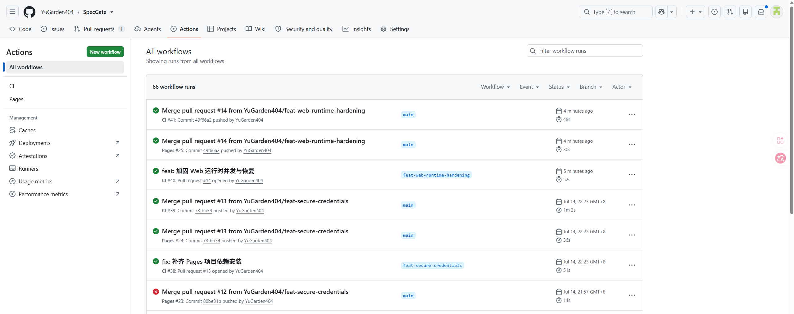
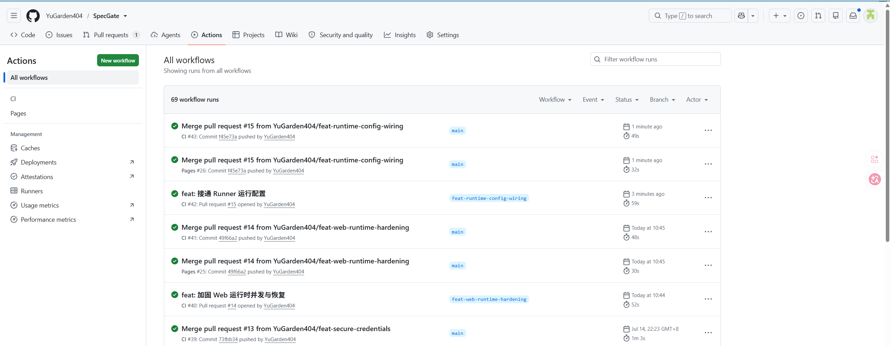
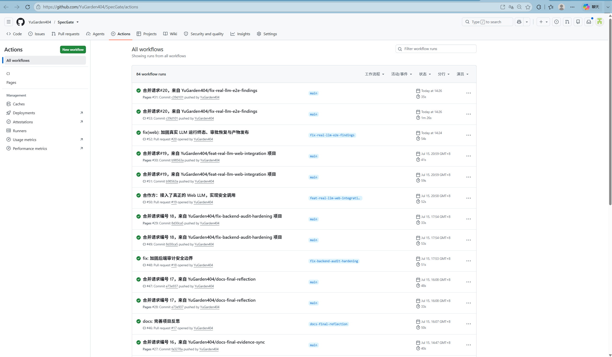
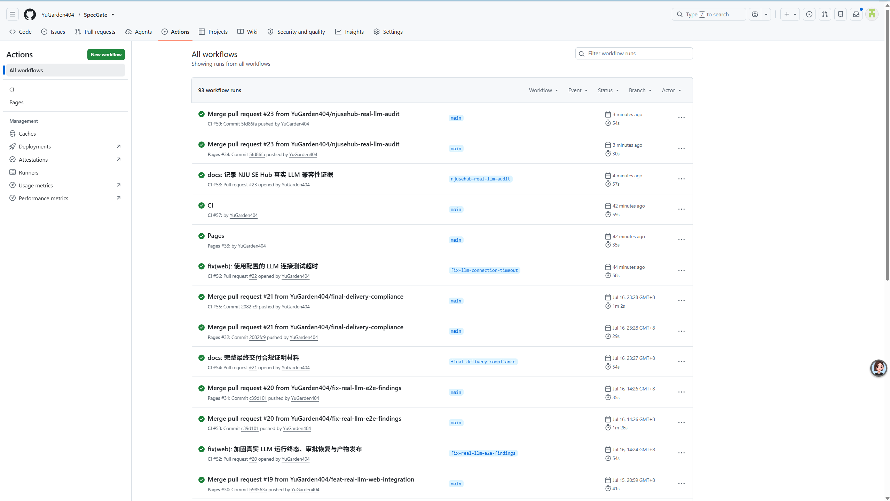
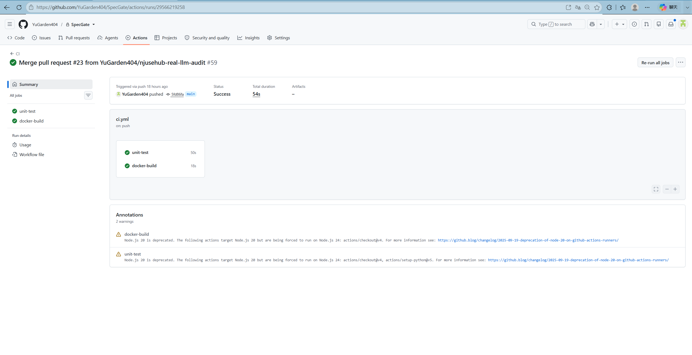
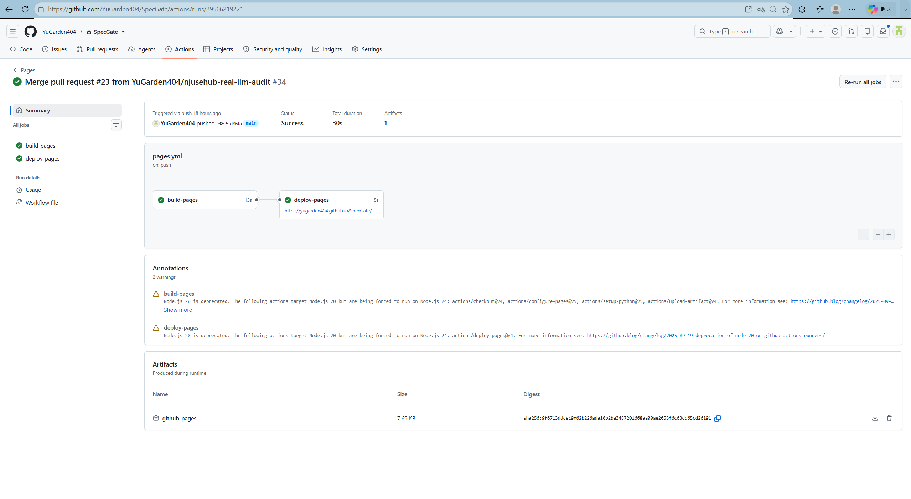

# SpecGate 最终验证证据矩阵

## 1. 证据口径

本文件是最终交付的权威证据入口。事实优先级为：当前代码与测试 → Git/PR → CI/Pages 与截图 → 当时的 Agent Log → 旧说明文档。课程自动验收只使用 MockLLM/Fake/Stub，不需要真实 LLM、API key 或网络；Web 后端在用户完整配置后可为新 run 启用真实模型，失败不会降级到 Mock。

## 2. 最终版本快照

- 当前主线基线：`main@5fd86fa`，最近已合并阶段为 PR #23。
- 当前最终验证（2026-07-17 NJU SE Hub 审计分支）：`Ran 921 tests in 403.030s`、`OK (skipped=27)`，命令退出码为 0。
- 当前远端证据：PR #23 合并后的 [CI #59](https://github.com/YuGarden404/SpecGate/actions/runs/29566219258) 与 [Pages #34](https://github.com/YuGarden404/SpecGate/actions/runs/29566219221) 均成功；列表截图见 `docs/evidence/github-actions-pr23-final.png`，job 详情截图见 `docs/evidence/github-actions-pr23-ci-detail.png` 与 `docs/evidence/github-actions-pr23-pages-detail.png`。
- 执行归属历史：PR #18、PR #19、PR #20 均已记录主开发 Agent 为 OpenAI Codex，并区分人工参与与 Mock/Fake/Stub 自动测试边界。
- 历史远端证据：PR #20 的 `main@c39d101`、[CI #53](https://github.com/YuGarden404/SpecGate/actions/runs/29476693238)、[Pages #31](https://github.com/YuGarden404/SpecGate/actions/runs/29476693242) 与 `docs/evidence/github-actions-pr20-final.png` 继续保留，完整 job 映射见第 6 节。
- 双仓库边界：GitHub 开发主仓库保留 commit、PR、GitHub PR/Actions 和 Pages 证据；NJU GitLab 课程镜像尚未创建，创建后先保持 Private，检查前改为 Public，并以独立 GitLab Pipeline 作为课程镜像验证。
- 公开入口：<https://yugarden404.github.io/SpecGate/>。

## 3. 课程交付物

| 要求 | 状态 | 仓库证据 | 复现方式 |
| --- | --- | --- | --- |
| SPEC / PLAN / 过程记录 | 已完成 | `SPEC.md`、`PLAN.md`、`SPEC_PROCESS.md` | 从 README 评审入口阅读 |
| 自实现 Harness | 已完成 | `src/specgate/runner.py`、`src/specgate/actions.py`、`src/specgate/tools.py` | Runner 机制测试 |
| MockLLM 确定性测试 | 已完成 | `tests/test_runner.py`、`tests/test_cli.py` | `python -m unittest tests.test_runner tests.test_cli` |
| 凭据治理 | 已完成 | `src/specgate/credentials.py`、`src/specgate/web_credentials.py` | 凭据测试，无明文回显 |
| 公开静态评审入口 | 已完成 | GitHub Pages 首页、demo、报告 | 打开 README 中的三个 Pages URL |
| 本地交互式 WebUI | 已完成 | `Dockerfile`、Web 运行时与确定性测试 | Docker/本地启动与确定性测试 |
| 公网交互式 Web 后端 | 待完成 | 后续独立部署阶段 | 任务 6 人工门禁之后另行部署与核验 |
| Docker 本地与 CI 构建 | 已完成 | `Dockerfile`、`.gitlab-ci.yml` | Docker build/smoke 与 CI |
| 公开容器 registry | 待完成 | 后续 GHCR 分发阶段 | 发布后另行记录公开镜像地址与摘要 |
| 学生反思 | 已由学生确认 | `REFLECTION.md`、`docs/REFLECTION_FACT_CHECK.md` | PR #17 与学生确认记录 |

## 4. 核心机制

| 机制 | 实现 | 确定性测试 | 演示证据 |
| --- | --- | --- | --- |
| Agent loop / 停机 | `src/specgate/runner.py` | `tests/test_runner.py` | Gate 反馈改变下一步 action |
| Action / Tool Dispatcher | `src/specgate/actions.py`、`src/specgate/tools.py` | `tests/test_actions.py`、`tests/test_tools.py` | 非法 action 与越权工具失败关闭 |
| WorkspacePolicy / 路径安全 | `src/specgate/policy.py`、`src/specgate/workspace_fs.py` | `tests/test_policy.py`、`tests/test_workspace_fs.py` | `.env`、路径逃逸、链接路径被阻止 |
| Checklist / Gate | `src/specgate/gate.py`、`src/specgate/checklist_rules.py` | `tests/test_gate.py`、`tests/test_checklist_rules.py` | 最终 Gate 与输入 SHA-256 |
| HITL / CAS / resume | `src/specgate/approvals.py`、`src/specgate/web_approvals.py` | `tests/test_approvals.py`、`tests/test_web_approvals.py` | approve/deny → resume 闭环 |
| Context Select/Compress/Isolate | `src/specgate/context.py`、`src/specgate/retrieval.py`、`src/specgate/context_lifecycle.py` | `tests/test_context.py`、`tests/test_runner.py` | security benchmark 与多策略 benchmark |
| 安全凭据 | `src/specgate/credentials.py`、`src/specgate/web_credentials.py` | `tests/test_credentials.py`、`tests/test_credential_store.py`、`tests/test_web_credentials.py` | OS keyring / AES-256-GCM，不回显明文 |
| Web 有界运行时 | `src/specgate/web_runtime.py`、`src/specgate/web_runs.py` | `tests/test_web_runtime.py`、`tests/test_web_runs.py` | 固定 worker、有界队列、取消/超时/恢复 |
| 不可变运行配置 | `src/specgate/runtime_config.py`、`src/specgate/web_db.py` | `tests/test_runtime_config.py`、`tests/test_web_db.py` | schema v5 `runtime_config_json` 快照 |
| 可选真实模型 | `src/specgate/llm_config.py`、`src/specgate/llm_transport.py`、`src/specgate/web_llm.py` | `tests/test_llm_config.py`、`tests/test_llm_transport.py`、`tests/test_web_llm.py` | schema v5 `llm_config_json`、SSRF/TLS/重试/取消与 Factory 冻结 |
| Trace / Debug / Audit | `src/specgate/trace.py`、`src/specgate/web_debug.py` | `tests/test_web_debug.py`、`tests/test_web_static.py` | 实际运行配置和审计证据 |

## 5. 最近阶段 Git / PR / CI

| 阶段 | 功能 commit | Merge commit | PR | 远端证据 |
| --- | --- | --- | --- | --- |
| Gate/HITL | `e17b8e5` | `f2b4e88` | [#11](https://github.com/YuGarden404/SpecGate/pull/11) | PR 与最终 main CI |
| 安全凭据 | `fecc5e3` | `80be31b` | [#12](https://github.com/YuGarden404/SpecGate/pull/12) | Pages 失败历史保留在截图 |
| Pages 热修复 | `20c0102` | `73fbb34` | [#13](https://github.com/YuGarden404/SpecGate/pull/13) | `evidence/github-actions-web-runtime-and-credentials.png` |
| Web 运行时 | `e5fc981` | `49f66a2` | [#14](https://github.com/YuGarden404/SpecGate/pull/14) | `evidence/github-actions-web-runtime-and-credentials.png` |
| Runner 配置 | `a523137` | `f45e73a` | [#15](https://github.com/YuGarden404/SpecGate/pull/15) | `evidence/github-actions-runtime-config.png` |
| 最终材料 | `116cc10` | `fa3278a` | [#16](https://github.com/YuGarden404/SpecGate/pull/16) | 合并后 CI/Pages |
| 学生反思 | `d550032` | `e73e937` | [#17](https://github.com/YuGarden404/SpecGate/pull/17) | CI #47、Pages #28 |
| 后端审计加固 | `d3607c4` | `8d30ca5` | [#18](https://github.com/YuGarden404/SpecGate/pull/18) | PR “执行归属”已核对；OpenAI Codex、人工参与与自动测试边界已记录 |
| Web 真实 LLM 接入 | `5279a7c` | `b98563a` | [#19](https://github.com/YuGarden404/SpecGate/pull/19) | PR “执行归属”已核对；OpenAI Codex、人工参与与自动测试边界已记录 |
| 真实 LLM 生命周期修复 | `e35eb46` | `c39d101` | [#20](https://github.com/YuGarden404/SpecGate/pull/20) | PR “执行归属”已核对；[CI #53](https://github.com/YuGarden404/SpecGate/actions/runs/29476693238)、[Pages #31](https://github.com/YuGarden404/SpecGate/actions/runs/29476693242) 与 `docs/evidence/github-actions-pr20-final.png` |
| 最终交付合规 | `e34452c` | `2082fc9` | [#21](https://github.com/YuGarden404/SpecGate/pull/21) | 最终交付合规材料与完整验证 |
| LLM 连接测试超时修复 | `a5861aa` | `3905e1e` | [#22](https://github.com/YuGarden404/SpecGate/pull/22) | 学校真实模型连接测试使用配置的请求超时 |
| NJU SE Hub 真实 LLM 审计 | `5635ad2` | `5fd86fa` | [#23](https://github.com/YuGarden404/SpecGate/pull/23) | [CI #59](https://github.com/YuGarden404/SpecGate/actions/runs/29566219258)、[Pages #34](https://github.com/YuGarden404/SpecGate/actions/runs/29566219221) 与三张 PR #23 截图 |

## 6. CI 与截图说明



截图如实保留 PR #12 合并后的 Pages 失败，以及 PR #13 修复后 CI/Pages 和 PR #14 成功。失败不是最终状态，但属于重要调试证据。



截图记录 PR #15、合并后 main CI #43 和 Pages #26 均通过。Workflow 定义见 `.github/workflows/ci.yml`、`.github/workflows/pages.yml`；GitLab 课程要求见 `.gitlab-ci.yml`，Docker 本地与 CI 构建定义见 `Dockerfile`。这些历史证据不代表镜像已经发布到公开容器 registry，也不代表公网交互式 Web 后端已经部署。



用户提供的截图显示 `YuGarden404/SpecGate` Actions 列表中的 PR #20 合并标题，以及以下由主线程只读复核的来源链：

- [CI #53](https://github.com/YuGarden404/SpecGate/actions/runs/29476693238) → `main@c39d101` → `unit-test`、`docker-build` → 成功
- [Pages #31](https://github.com/YuGarden404/SpecGate/actions/runs/29476693242) → `main@c39d101` → `build-pages`、`deploy-pages` → 成功

截图无凭据或账户敏感信息。该证据只证明当前 main 的自动测试、Docker CI 构建与静态 Pages 发布链成功；公网交互式 Web 后端和公开容器 registry 仍待后续独立阶段完成。



用户提供的列表截图显示 PR #23 合并标题、`main@5fd86fa`，以及 CI #59 与 Pages #34 均为绿色成功。精确来源链为：

- [CI #59](https://github.com/YuGarden404/SpecGate/actions/runs/29566219258) → `main@5fd86fa` → `unit-test`、`docker-build` → 成功
- [Pages #34](https://github.com/YuGarden404/SpecGate/actions/runs/29566219221) → `main@5fd86fa` → `build-pages`、`deploy-pages` → 成功



CI 详情截图显示总状态 `Success`，`unit-test` 和 `docker-build` 均成功。页面同时显示 GitHub Actions 的 Node.js 20 弃用 warning；该 warning 不改变本次 job 成功状态，但作为真实远端输出保留。



Pages 详情截图显示总状态 `Success`，`build-pages` 和 `deploy-pages` 均成功，并产生 `github-pages` artifact。三张 PR #23 图片均通过 PNG 结构校验，未见 token、API key、密码或其他凭据。

主线程在本轮通过只读浏览器重新核对公开 Pages；本地验证 Subagent 没有亲自浏览远端：

- 首页：标题 `SpecGate WebUI`，主标题 `SpecGate 静态 HTML 生成与修复闭环`
- demo：标题与主标题均为 `AI for Coding 知识图谱`
- report：标题与主标题均为 `SpecGate Run Report`

## 7. 核心机制复现

```powershell
$env:PYTHONPATH="src"
python -m unittest tests.test_runner.RunnerTests.test_guardrail_block_is_recorded
python -m unittest tests.test_runner.RunnerTests.test_gate_failure_feedback_changes_next_action
python -m unittest tests.test_runner.RunnerTests.test_review_action_pauses_before_next_llm_call tests.test_runner.RunnerTests.test_resume_from_approved_approval_applies_payload_once_and_continues
python -m unittest tests.test_cli.CliTests.test_repository_security_benchmark_smoke tests.test_cli.CliTests.test_repository_multi_strategy_benchmark_smoke
```

## 8. 完整验证

```powershell
$env:PYTHONPATH="src"
python -m unittest discover -s tests
python -m compileall -q src tests
node --check src/specgate/web_static/app.js
git diff --check
```

当前最终结果（2026-07-17 NJU SE Hub 审计分支）：

- 文档与工作流契约：`Ran 20 tests in 0.065s`、`OK`，退出码 0。
- 六项确定性机制：`Ran 6 tests in 47.709s`、`OK`，退出码 0。
- 完整套件：`Ran 921 tests in 403.030s`、`OK (skipped=27)`，退出码 0。
- `python -m compileall -q src tests`、`node --check src/specgate/web_static/app.js` 与 `git diff --check` 均退出码 0 且无错误输出。
- `.env` 由 `.gitignore:8` 忽略，`.env` 提交历史为空；排除测试与实施计划后的疑似密钥模式扫描无命中。

历史阶段结果（2026-07-15 Web 真实 LLM 接入分支）：`Ran 896 tests in 216.620s`、`OK (skipped=27)`。该数字早于 PR #20 生命周期修复，不代表当前快照。非法 `unsafe` governance profile 的 argparse 输出来自预期拒绝测试，不是失败；跳过项主要来自 Windows 当前没有创建符号链接的权限和仓库既有平台条件。

## 9. 边界

- 自动验收只使用 MockLLM/Fake/Stub，不访问真实 DNS、socket 或 Provider。
- Web 默认使用 MockLLM；完整配置后新 run 可使用真实模型，Provider 失败不会降级。
- GitHub Pages 仅为静态展示，真实模式需要部署 Web 后端、持久化数据库、凭据主密钥与 `SPECGATE_LLM_ALLOWED_HOSTS` 网络策略。
- 本地交互式 WebUI 已具备 Docker/本地启动与确定性测试；公网交互式 Web 后端和公开容器 registry 均待后续独立阶段完成。发布镜像不等于部署服务。
- GitHub 是开发主仓库；NJU GitLab 课程镜像尚未创建。创建后仅同步 `main` 与 tags，先保持 Private，检查前改为 Public；GitHub PR/Actions 不迁移为 GitLab 平台元数据，GitLab Pipeline 必须独立通过。
- 不开放 shell，不执行同源模型生成 HTML。
- CLI 持久化凭据使用 OS keyring；Web 使用独立主密钥和 AES-256-GCM。
- `.env` 只作为被保护路径和威胁示例出现，SpecGate 不读写 `.env`。
- 旧 HMAC 只作为迁移来源，迁移后要求重新录入。
- `REFLECTION.md` 的观点和最终文字由学生本人负责。
