# SpecGate 最终验证证据矩阵

## 1. 证据口径

本文件是最终交付的权威证据入口。事实优先级为：当前代码与测试 → Git/PR → CI/Pages 与截图 → 当时的 Agent Log → 旧说明文档。课程自动验收只使用 MockLLM/Fake/Stub，不需要真实 LLM、API key 或网络；Web 后端在用户完整配置后可为新 run 启用真实模型，失败不会降级到 Mock。

## 2. 最终版本快照

- 当前主线基线：`main@44b236f`，最近已合并阶段为 PR #25。
- 当前最终验证（2026-07-18 GHCR CLI 分发分支）：`Ran 947 tests in 227.115s`、`OK (skipped=27)`，命令退出码为 0。
- 当前远端证据：PR #25 合并后的 [CI #63](https://github.com/YuGarden404/SpecGate/actions/runs/29649068245)、[Pages #36](https://github.com/YuGarden404/SpecGate/actions/runs/29649068246) 与 `v0.1.0` 触发的 [GHCR #1](https://github.com/YuGarden404/SpecGate/actions/runs/29649149933) 均成功；证据为 `docs/evidence/github-actions-pr25-ci-success.png`、`docs/evidence/github-actions-pr25-pages-success.png`、`docs/evidence/github-actions-ghcr-v0.1.0-success.png`、`docs/evidence/github-package-specgate-public.png` 与 `docs/evidence/ghcr-anonymous-pull-smoke.png`。
- 执行归属历史：PR #18、PR #19、PR #20 均已记录主开发 Agent 为 OpenAI Codex，并区分人工参与与 Mock/Fake/Stub 自动测试边界。
- 历史远端证据：PR #20 的 `main@c39d101`、[CI #53](https://github.com/YuGarden404/SpecGate/actions/runs/29476693238)、[Pages #31](https://github.com/YuGarden404/SpecGate/actions/runs/29476693242) 与 `docs/evidence/github-actions-pr20-final.png` 继续保留，完整 job 映射见第 6 节。
- 双仓库边界：SpecGate 是 CLI-first Harness；GitHub 开发主仓库保留 commit、PR、完整 GitHub Actions、Docker 构建与 Pages 证据，[NJU GitLab 课程镜像](https://git.nju.edu.cn/YuyuanLiang/specgate) 只保留 `unit-test`。Pipeline #312781、#312784、#312797 的三次 `unit-test` 已通过，`docker-build` 分别暴露 DinD 权限、`gcr.io` 网络和 RootlessKit 权限限制；最终 [Pipeline #312806](https://git.nju.edu.cn/YuyuanLiang/specgate/-/pipelines/312806) 在 `main@66ea825` 上通过，检查前改为 Public。
- 公开入口：<https://yugarden404.github.io/SpecGate/>。

## 3. 课程交付物

| 要求 | 状态 | 仓库证据 | 复现方式 |
| --- | --- | --- | --- |
| SPEC / PLAN / 过程记录 | 已完成 | `SPEC.md`、`PLAN.md`、`SPEC_PROCESS.md` | 从 README 评审入口阅读 |
| 自实现 Harness | 已完成 | `src/specgate/runner.py`、`src/specgate/actions.py`、`src/specgate/tools.py` | Runner 机制测试 |
| MockLLM 确定性测试 | 已完成 | `tests/test_runner.py`、`tests/test_cli.py` | `python -m unittest tests.test_runner tests.test_cli` |
| 凭据治理 | 已完成 | `src/specgate/credentials.py`、`src/specgate/web_credentials.py` | 凭据测试，无明文回显 |
| 公开静态评审入口 | 已完成 | GitHub Pages 首页、demo、报告 | 打开 README 中的三个 Pages URL |
| 本地交互式 WebUI | 已完成 | `Dockerfile`、Web 运行时与确定性测试 | Docker/本地启动与确定性测试 |
| 公网交互式 Web 后端 | 待完成 | 后续独立部署阶段 | 任务 6 人工门禁之后另行部署与核验 |
| Docker 本地与 CI 构建 | 已完成 | `Dockerfile`、`.github/workflows/ci.yml` | Docker build/smoke 与 GitHub Actions |
| 公开容器 registry | 已完成 | `ghcr.io/yugarden404/specgate:0.1.0`、Public Package 与三张 GHCR 证据图 | 匿名 pull、CLI help、Mock Demo 与 RepoDigest 均已核验 |
| 学生反思 | 已由学生确认 | `REFLECTION.md`、`docs/REFLECTION_FACT_CHECK.md` | PR #17 与学生确认记录 |

## 4. 核心机制

| 机制 | 实现 | 确定性测试 | 演示证据 |
| --- | --- | --- | --- |
| Agent loop / 停机 | `src/specgate/runner.py` | `tests/test_runner.py` | Gate 反馈改变下一步 action |
| Action / Tool Dispatcher | `src/specgate/actions.py`、`src/specgate/tools.py` | `tests/test_actions.py`、`tests/test_tools.py` | 非法 action 与越权工具失败关闭 |
| WorkspacePolicy / 路径安全 | `src/specgate/policy.py`、`src/specgate/workspace_fs.py` | `tests/test_policy.py`、`tests/test_workspace_fs.py` | `.env`、路径逃逸、链接路径被阻止 |
| Checklist / Gate | `src/specgate/gate.py`、`src/specgate/checklist_rules.py` | `tests/test_gate.py`、`tests/test_checklist_rules.py` | 最终 Gate 与输入 SHA-256 |
| HITL / CAS / resume | `src/specgate/approvals.py`、`src/specgate/web_approvals.py` | `tests/test_approvals.py`、`tests/test_web_approvals.py` | approve/deny → resume 闭环 |
| Context Select/Compress/Isolate | `src/specgate/context.py`、`src/specgate/retrieval.py`、`src/specgate/context_lifecycle.py` | `tests/test_context.py`、`tests/test_runner.py` | security benchmark 与多策略 benchmark |
| 安全凭据 | `src/specgate/credentials.py`、`src/specgate/web_credentials.py` | `tests/test_credentials.py`、`tests/test_credential_store.py`、`tests/test_web_credentials.py` | OS keyring / AES-256-GCM，不回显明文 |
| Web 有界运行时 | `src/specgate/web_runtime.py`、`src/specgate/web_runs.py` | `tests/test_web_runtime.py`、`tests/test_web_runs.py` | 固定 worker、有界队列、取消/超时/恢复 |
| 不可变运行配置 | `src/specgate/runtime_config.py`、`src/specgate/web_db.py` | `tests/test_runtime_config.py`、`tests/test_web_db.py` | schema v5 `runtime_config_json` 快照 |
| 可选真实模型 | `src/specgate/llm_config.py`、`src/specgate/llm_transport.py`、`src/specgate/web_llm.py` | `tests/test_llm_config.py`、`tests/test_llm_transport.py`、`tests/test_web_llm.py` | schema v5 `llm_config_json`、SSRF/TLS/重试/取消与 Factory 冻结 |
| Trace / Debug / Audit | `src/specgate/trace.py`、`src/specgate/web_debug.py` | `tests/test_web_debug.py`、`tests/test_web_static.py` | 实际运行配置和审计证据 |

## 5. 最近阶段 Git / PR / CI

| 阶段 | 功能 commit | Merge commit | PR | 远端证据 |
| --- | --- | --- | --- | --- |
| Gate/HITL | `e17b8e5` | `f2b4e88` | [#11](https://github.com/YuGarden404/SpecGate/pull/11) | PR 与最终 main CI |
| 安全凭据 | `fecc5e3` | `80be31b` | [#12](https://github.com/YuGarden404/SpecGate/pull/12) | Pages 失败历史保留在截图 |
| Pages 热修复 | `20c0102` | `73fbb34` | [#13](https://github.com/YuGarden404/SpecGate/pull/13) | `evidence/github-actions-web-runtime-and-credentials.png` |
| Web 运行时 | `e5fc981` | `49f66a2` | [#14](https://github.com/YuGarden404/SpecGate/pull/14) | `evidence/github-actions-web-runtime-and-credentials.png` |
| Runner 配置 | `a523137` | `f45e73a` | [#15](https://github.com/YuGarden404/SpecGate/pull/15) | `evidence/github-actions-runtime-config.png` |
| 最终材料 | `116cc10` | `fa3278a` | [#16](https://github.com/YuGarden404/SpecGate/pull/16) | 合并后 CI/Pages |
| 学生反思 | `d550032` | `e73e937` | [#17](https://github.com/YuGarden404/SpecGate/pull/17) | CI #47、Pages #28 |
| 后端审计加固 | `d3607c4` | `8d30ca5` | [#18](https://github.com/YuGarden404/SpecGate/pull/18) | PR “执行归属”已核对；OpenAI Codex、人工参与与自动测试边界已记录 |
| Web 真实 LLM 接入 | `5279a7c` | `b98563a` | [#19](https://github.com/YuGarden404/SpecGate/pull/19) | PR “执行归属”已核对；OpenAI Codex、人工参与与自动测试边界已记录 |
| 真实 LLM 生命周期修复 | `e35eb46` | `c39d101` | [#20](https://github.com/YuGarden404/SpecGate/pull/20) | PR “执行归属”已核对；[CI #53](https://github.com/YuGarden404/SpecGate/actions/runs/29476693238)、[Pages #31](https://github.com/YuGarden404/SpecGate/actions/runs/29476693242) 与 `docs/evidence/github-actions-pr20-final.png` |
| 最终交付合规 | `e34452c` | `2082fc9` | [#21](https://github.com/YuGarden404/SpecGate/pull/21) | 最终交付合规材料与完整验证 |
| LLM 连接测试超时修复 | `a5861aa` | `3905e1e` | [#22](https://github.com/YuGarden404/SpecGate/pull/22) | 学校真实模型连接测试使用配置的请求超时 |
| NJU SE Hub 真实 LLM 审计 | `5635ad2` | `5fd86fa` | [#23](https://github.com/YuGarden404/SpecGate/pull/23) | [CI #59](https://github.com/YuGarden404/SpecGate/actions/runs/29566219258)、[Pages #34](https://github.com/YuGarden404/SpecGate/actions/runs/29566219221) 与三张 PR #23 截图 |
| 最终提交同步与双仓库交付 | `9c25621` | `7cecbb1` | [#24](https://github.com/YuGarden404/SpecGate/pull/24) | GitHub 最终材料与 NJU GitLab 成功证据同步 |
| CLI 易用性与 GHCR 分发 | `f8c5c7a` | `44b236f` | [#25](https://github.com/YuGarden404/SpecGate/pull/25) | [CI #63](https://github.com/YuGarden404/SpecGate/actions/runs/29649068245)、[Pages #36](https://github.com/YuGarden404/SpecGate/actions/runs/29649068246) 与 [GHCR #1](https://github.com/YuGarden404/SpecGate/actions/runs/29649149933) |

## 6. CI 与截图说明


截图如实保留 PR #12 合并后的 Pages 失败，以及 PR #13 修复后 CI/Pages 和 PR #14 成功。失败不是最终状态，但属于重要调试证据。


截图记录 PR #15、合并后 main CI #43 和 Pages #26 均通过。Workflow 定义见 `.github/workflows/ci.yml`、`.github/workflows/pages.yml`；GitLab 课程要求见 `.gitlab-ci.yml`，Docker 本地与 CI 构建定义见 `Dockerfile`。这些历史证据不代表镜像已经发布到公开容器 registry，也不代表公网交互式 Web 后端已经部署。


用户提供的截图显示 `YuGarden404/SpecGate` Actions 列表中的 PR #20 合并标题，以及以下由主线程只读复核的来源链：

- [CI #53](https://github.com/YuGarden404/SpecGate/actions/runs/29476693238) → `main@c39d101` → `unit-test`、`docker-build` → 成功
- [Pages #31](https://github.com/YuGarden404/SpecGate/actions/runs/29476693242) → `main@c39d101` → `build-pages`、`deploy-pages` → 成功

截图无凭据或账户敏感信息。该历史证据在 PR #20 阶段只证明当时 main 的自动测试、Docker CI 构建与静态 Pages 发布链成功；当时公网交互式 Web 后端和公开容器 registry 均尚未完成。


用户提供的列表截图显示 PR #23 合并标题、`main@5fd86fa`，以及 CI #59 与 Pages #34 均为绿色成功。精确来源链为：

- [CI #59](https://github.com/YuGarden404/SpecGate/actions/runs/29566219258) → `main@5fd86fa` → `unit-test`、`docker-build` → 成功
- [Pages #34](https://github.com/YuGarden404/SpecGate/actions/runs/29566219221) → `main@5fd86fa` → `build-pages`、`deploy-pages` → 成功


CI 详情截图显示总状态 `Success`，`unit-test` 和 `docker-build` 均成功。页面同时显示 GitHub Actions 的 Node.js 20 弃用 warning；该 warning 不改变本次 job 成功状态，但作为真实远端输出保留。


Pages 详情截图显示总状态 `Success`，`build-pages` 和 `deploy-pages` 均成功，并产生 `github-pages` artifact。三张 PR #23 图片均通过 PNG 结构校验，未见 token、API key、密码或其他凭据。

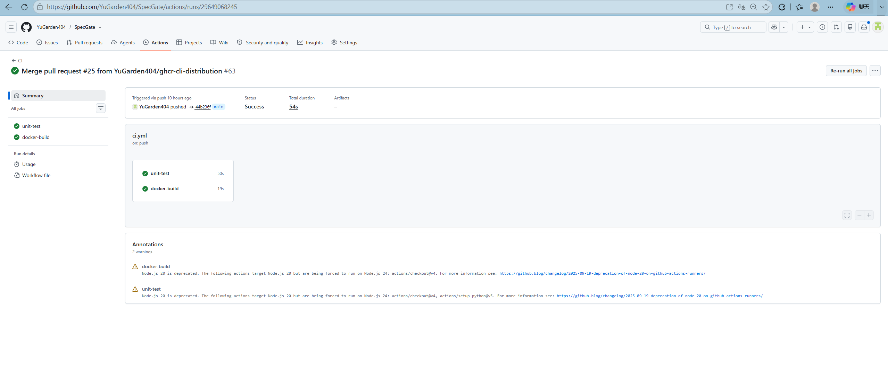

- [CI #63](https://github.com/YuGarden404/SpecGate/actions/runs/29649068245) → `main@44b236f` → `unit-test`、`docker-build` → 成功

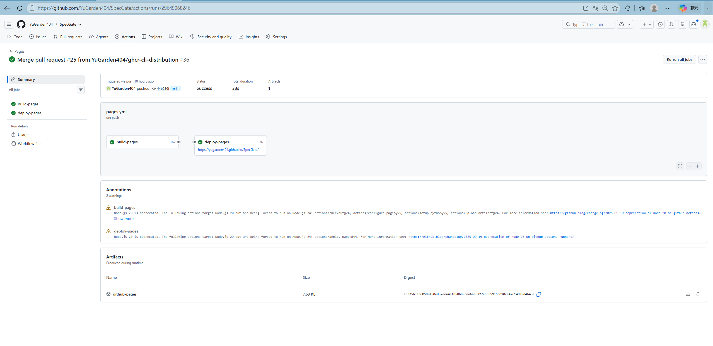

- [Pages #36](https://github.com/YuGarden404/SpecGate/actions/runs/29649068246) → `main@44b236f` → `build-pages`、`deploy-pages` → 成功

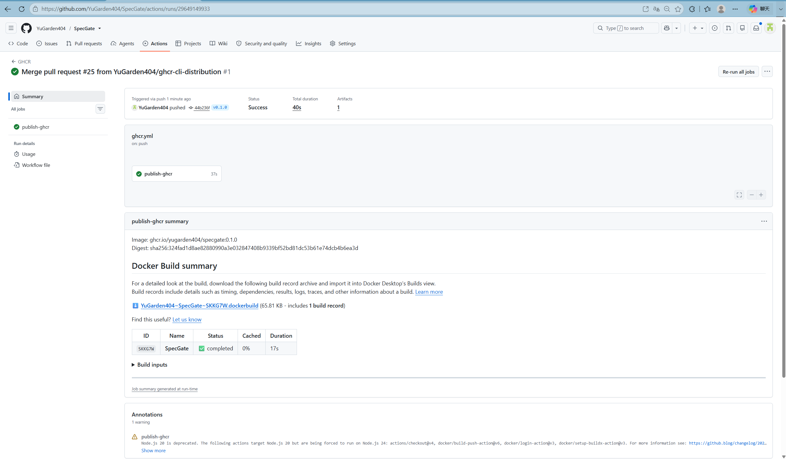

[GHCR #1](https://github.com/YuGarden404/SpecGate/actions/runs/29649149933) 由 `v0.1.0` 触发，绑定 `main@44b236f`，`publish-ghcr` 成功并输出镜像 `ghcr.io/yugarden404/specgate:0.1.0` 与 digest `sha256:324fad1d8ae82880990a3e032847408b9339bf52bd81dc53b61e74dcb4b6ea3d`。

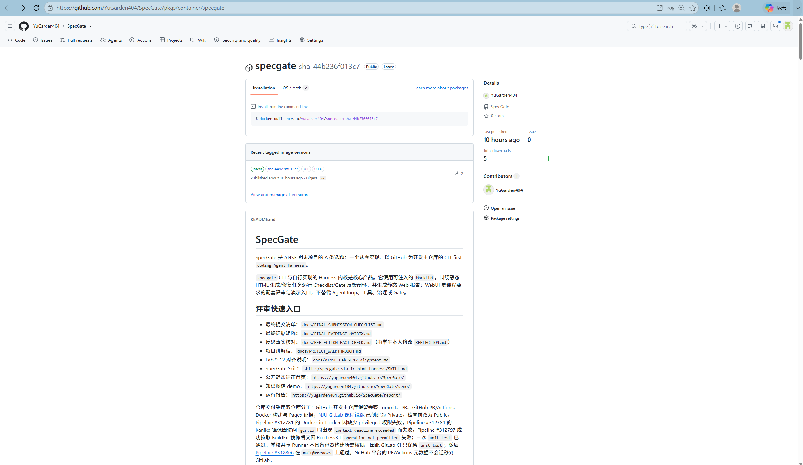

[Package 页面](https://github.com/YuGarden404/SpecGate/pkgs/container/specgate) 显示 `specgate` 为 Public，并列出 `latest`、`0.1`、`0.1.0` 与 commit SHA 标签。

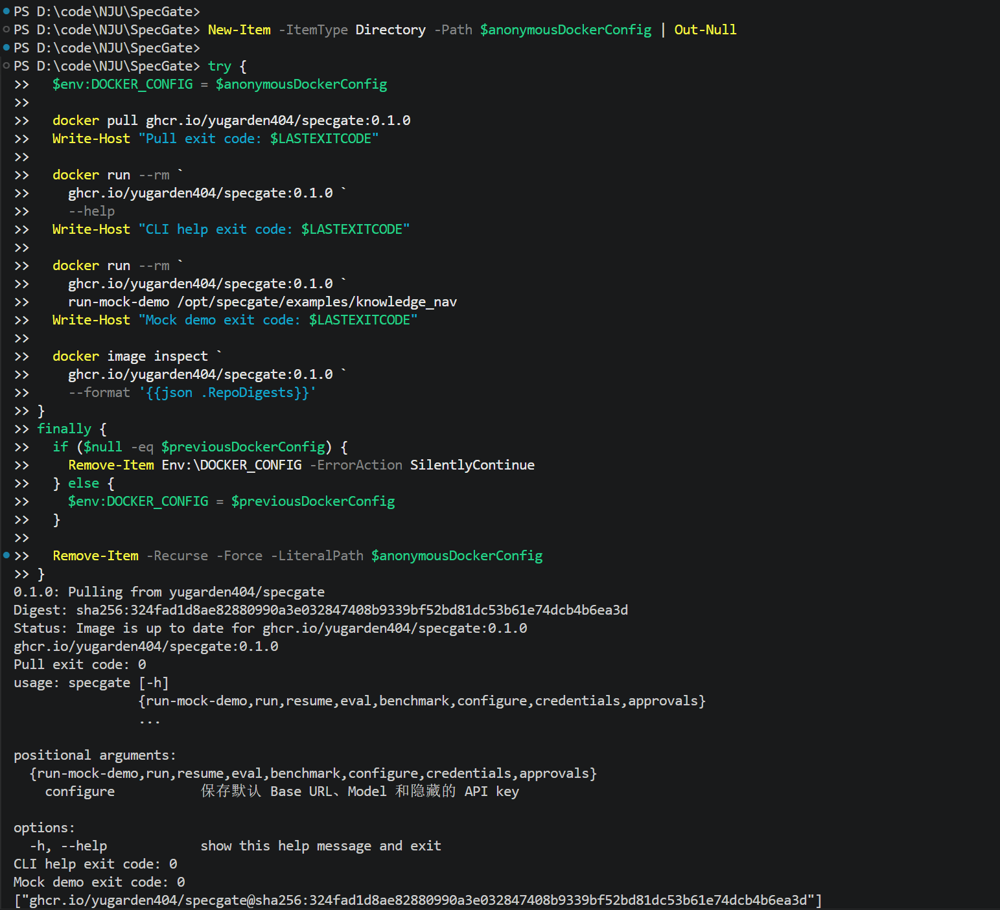

一次性空 Docker 配置下，`docker pull`、CLI help 与 Mock Demo 的退出码均为 0，RepoDigest 与 GHCR Actions 输出完全一致。GHCR 公开镜像已完成匿名拉取验证；五张 PR #25/GHCR 图片均未见 token、API key、密码或其他凭据。公网交互式 Web 后端未部署。

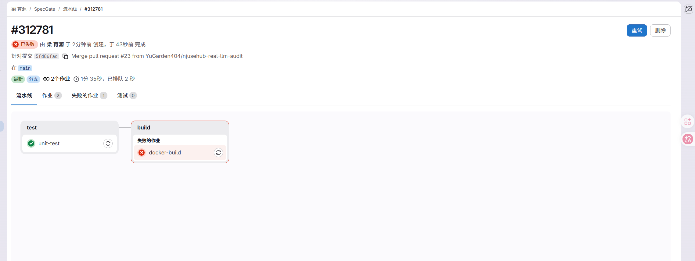

NJU GitLab Pipeline #312781 针对 `main@5fd86fa` 运行：`unit-test` 已通过，`docker-build` 失败，整体状态为失败。该失败属于真实课程镜像证据，不使用 GitHub Actions 成功替代。

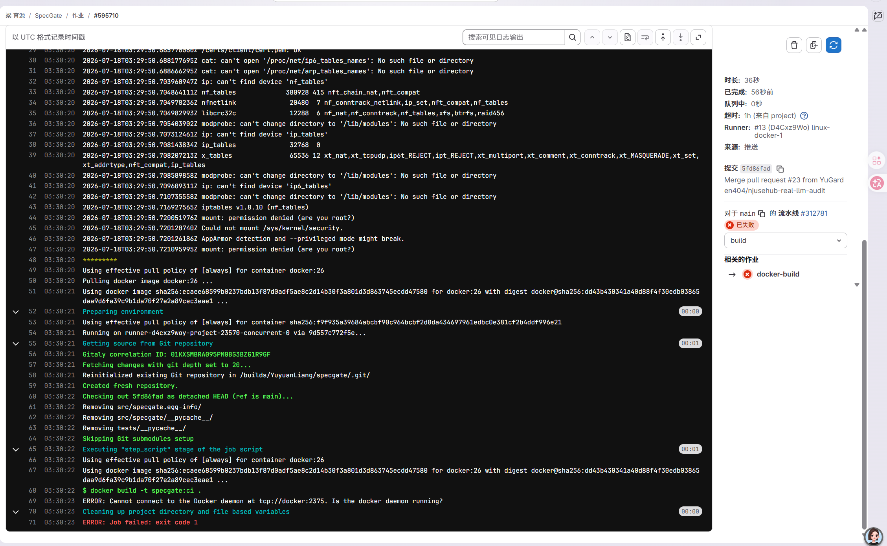

日志显示学校共享 Runner 的 Docker executor 未启用 privileged 模式，`docker:26-dind` 因挂载权限不足未启动，最终报错无法连接 `tcp://docker:2375`。这不是 Dockerfile 或测试失败；第一次修复因此改为不依赖 Docker daemon 的 Kaniko 构建。

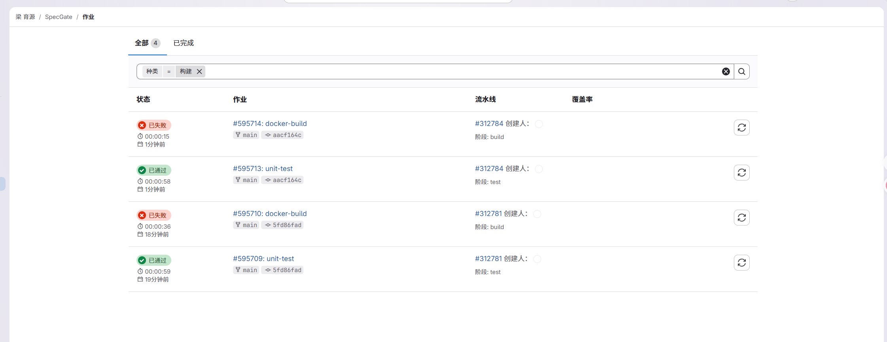

Pipeline #312784 运行 Kaniko 修复版本：`unit-test` 已通过，`docker-build` 失败，整体状态仍为失败。

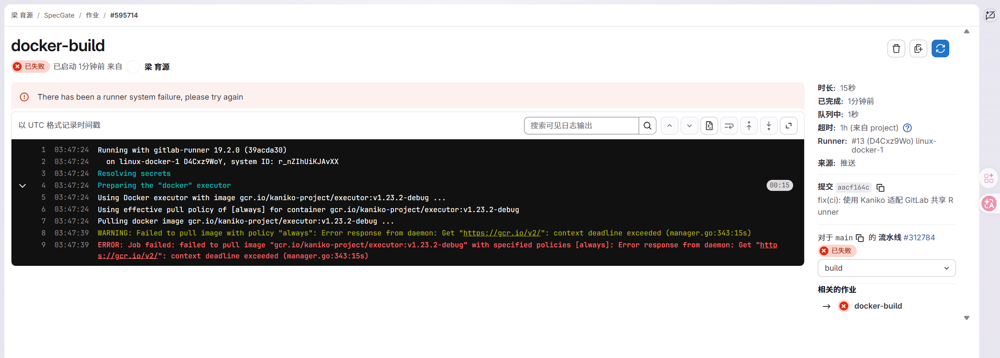

该 job 在执行仓库脚本前拉取 `gcr.io/kaniko-project/executor:v1.23.2-debug`，访问 `gcr.io` 时出现 `context deadline exceeded`。因此第二次根因是学校 Runner 到 GCR 的网络可达性，不是 Kaniko 或 Dockerfile 执行失败。

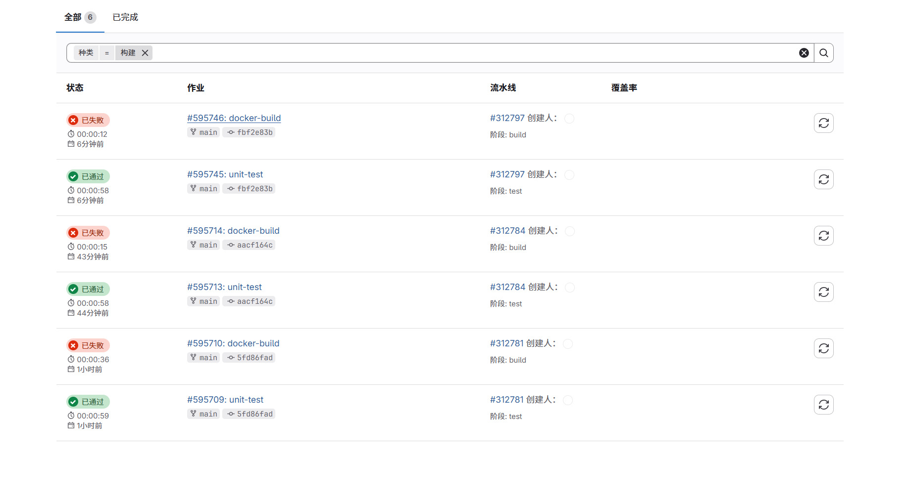

Pipeline #312797 运行 BuildKit 修复版本：`unit-test` 已通过，`docker-build` 失败，整体状态仍为失败。

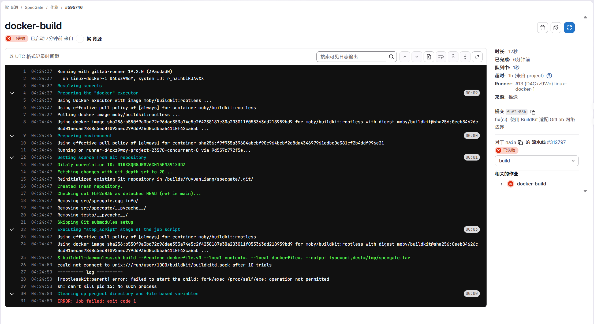

该 job 已成功从 Docker Hub 拉取 `moby/buildkit:rootless`、checkout `fbf2e83` 并执行 `buildctl-daemonless.sh`，随后 RootlessKit 报告 `fork/exec /proc/self/exe: operation not permitted`。因此第三次根因是共享 Runner 禁止 rootless user namespace，不是镜像网络、Dockerfile 或 Python 测试失败。容器构建继续由 GitHub Actions 的成功 `docker-build` job 覆盖；NJU GitLab CI 随后收缩为只保留 `unit-test`。

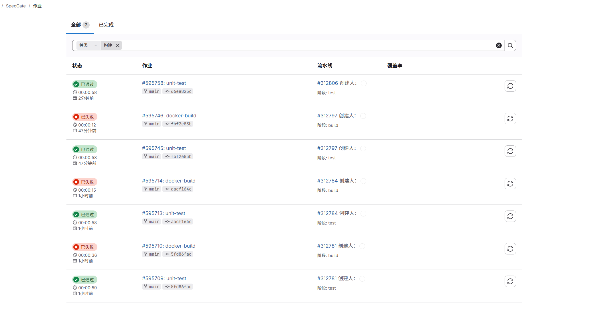

列表显示 commit `66ea825` 对应的 Pipeline #312806 只有 `unit-test`，状态为已通过；三次容器构建失败继续作为共享 Runner 能力边界的历史证据保留。

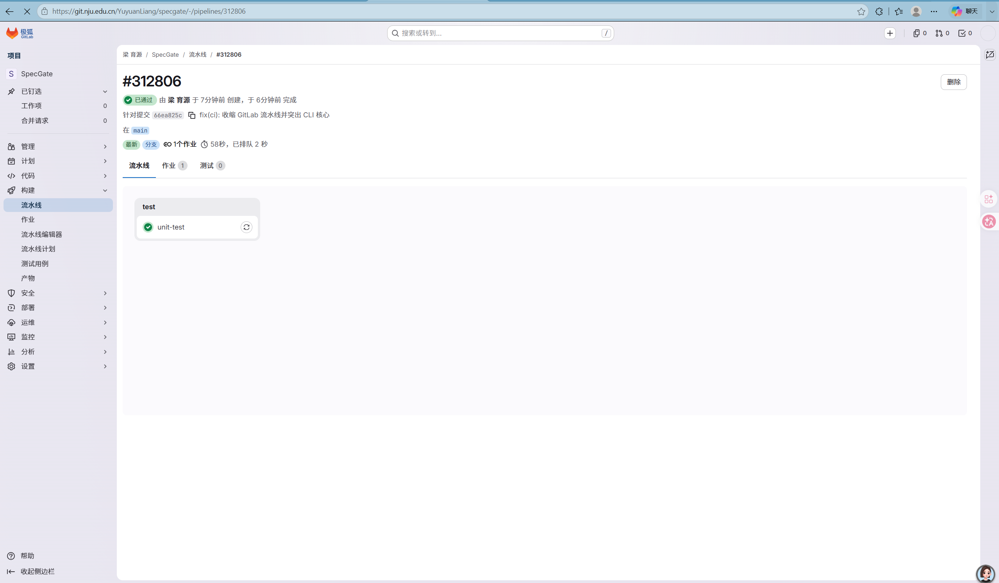

[Pipeline #312806](https://git.nju.edu.cn/YuyuanLiang/specgate/-/pipelines/312806) 针对 `main@66ea825` 运行，页面显示整体已通过，且只有 test stage 的 `unit-test` job。

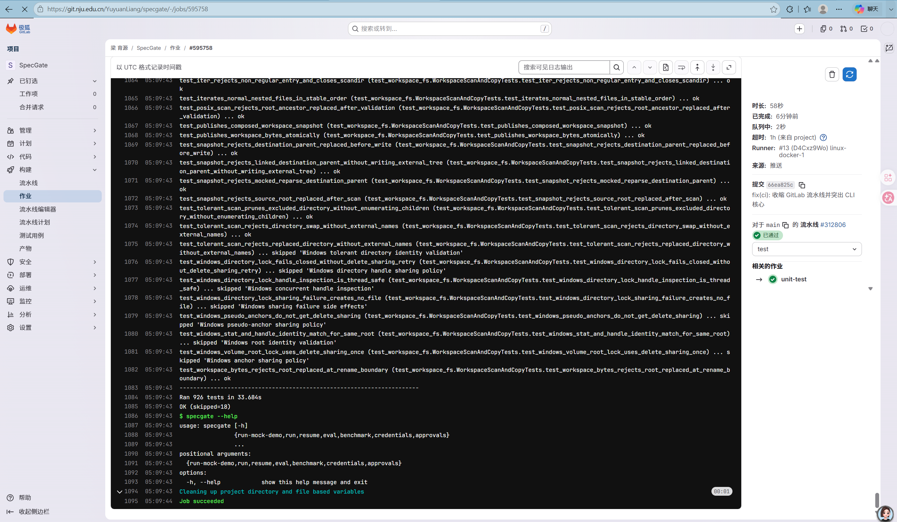

[job #595758](https://git.nju.edu.cn/YuyuanLiang/specgate/-/jobs/595758) 显示 `Ran 926 tests in 33.684s`、`OK (skipped=18)`，随后执行 `specgate --help` 并以 `Job succeeded` 结束。GitLab Pipeline 已通过；该成功与 GitHub Actions 的 Docker 构建证据职责独立。

主线程在本轮通过只读浏览器重新核对公开 Pages；本地验证 Subagent 没有亲自浏览远端：

- 首页：标题 `SpecGate WebUI`，主标题 `SpecGate 静态 HTML 生成与修复闭环`
- demo：标题与主标题均为 `AI for Coding 知识图谱`
- report：标题与主标题均为 `SpecGate Run Report`

## 7. 核心机制复现

```powershell
$env:PYTHONPATH="src"
python -m unittest tests.test_runner.RunnerTests.test_guardrail_block_is_recorded
python -m unittest tests.test_runner.RunnerTests.test_gate_failure_feedback_changes_next_action
python -m unittest tests.test_runner.RunnerTests.test_review_action_pauses_before_next_llm_call tests.test_runner.RunnerTests.test_resume_from_approved_approval_applies_payload_once_and_continues
python -m unittest tests.test_cli.CliTests.test_repository_security_benchmark_smoke tests.test_cli.CliTests.test_repository_multi_strategy_benchmark_smoke
```

## 8. 完整验证

```powershell
$env:PYTHONPATH="src"
python -m unittest discover -s tests
python -m compileall -q src tests
node --check src/specgate/web_static/app.js
git diff --check
```

当前最终结果（2026-07-18 GHCR CLI 分发分支）：

- 文档与工作流契约：`Ran 20 tests in 0.065s`、`OK`，退出码 0。
- 六项确定性机制：`Ran 6 tests in 47.709s`、`OK`，退出码 0。
- 完整套件：`Ran 947 tests in 227.115s`、`OK (skipped=27)`，退出码 0。
- `python -m compileall -q src tests`、`node --check src/specgate/web_static/app.js` 与 `git diff --check` 均退出码 0 且无错误输出。
- `.env` 由 `.gitignore:8` 忽略，`.env` 提交历史为空；排除测试与实施计划后的疑似密钥模式扫描无命中。

历史阶段结果（2026-07-15 Web 真实 LLM 接入分支）：`Ran 896 tests in 216.620s`、`OK (skipped=27)`。该数字早于 PR #20 生命周期修复，不代表当前快照。非法 `unsafe` governance profile 的 argparse 输出来自预期拒绝测试，不是失败；跳过项主要来自 Windows 当前没有创建符号链接的权限和仓库既有平台条件。

## 9. 边界

- 自动验收只使用 MockLLM/Fake/Stub，不访问真实 DNS、socket 或 Provider。
- Web 默认使用 MockLLM；完整配置后新 run 可使用真实模型，Provider 失败不会降级。
- GitHub Pages 仅为静态展示，真实模式需要部署 Web 后端、持久化数据库、凭据主密钥与 `SPECGATE_LLM_ALLOWED_HOSTS` 网络策略。
- 本地交互式 WebUI 已具备显式 Docker 入口与确定性测试；公开容器 registry 已完成，GHCR 公开镜像已完成匿名拉取验证。公网交互式 Web 后端未部署；发布镜像不等于部署服务。
- GitHub 是开发主仓库和完整测试、Docker 构建、Pages 的权威来源；NJU GitLab 课程镜像已创建为 Private，首次只同步 `main` 与 tags，检查前改为 Public。GitHub PR/Actions 不迁移为 GitLab 平台元数据；Pipeline #312781 的 DinD 权限失败、Pipeline #312784 的 `gcr.io` 超时和 Pipeline #312797 的 RootlessKit 权限失败均独立记录，最终 Pipeline #312806 的 `unit-test` 已通过。
- 不开放 shell，不执行同源模型生成 HTML。
- CLI 持久化凭据使用 OS keyring；Web 使用独立主密钥和 AES-256-GCM。
- `.env` 只作为被保护路径和威胁示例出现，SpecGate 不读写 `.env`。
- 旧 HMAC 只作为迁移来源，迁移后要求重新录入。
- `REFLECTION.md` 的观点和最终文字由学生本人负责。

## 10. 2026-07-18 CLI 与 GHCR 发布证据

- CLI 用户配置：`src/specgate/user_config.py` 只保存 provider、Base URL 与 Model；API key 继续使用环境变量或操作系统 keyring。`specgate configure` 使用隐藏输入，`specgate run <工作区>` 自动解析命令行、环境变量和用户默认配置。
- CLI-first 容器：`Dockerfile` 默认 `ENTRYPOINT ["specgate"]` 与 `CMD ["--help"]`；WebUI 通过 `--entrypoint specgate-web` 显式启动。常规 GitHub CI 同时定义 CLI help、Mock Demo 和 WebUI help smoke。
- GHCR 工作流：`.github/workflows/ghcr.yml` 仅在版本标签或显式手动重发时推送 `ghcr.io/yugarden404/specgate`，使用 `contents: read` 与 `packages: write`，不读取 LLM API key。
- 本地验证：实现前完整基线为 `Ran 926 tests in 228.716s`、`OK (skipped=27)`；配置/CLI 与 workflow 聚焦测试均已通过。实现阶段本机 Docker daemon 未运行，曾因 `docker_engine` named pipe 不存在而无法执行真实 build/smoke；该缺口随后由 CI #63 的 `docker-build` 成功和匿名 GHCR smoke 补齐。
- 完成门禁：`v0.1.0`、成功 Actions、Package Public、匿名 pull、CLI help、Mock Demo 和 digest 已全部成立，公开容器 registry 因而标为已完成。镜像分发不包含常驻服务，公网交互式 Web 后端未部署。
