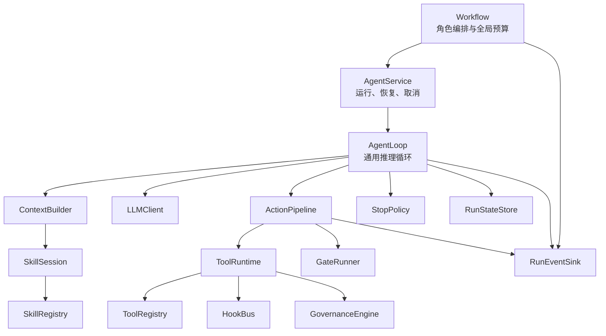

# SpecGate v0.2.0 Agent Runtime 分层架构设计

## 1. 背景

SpecGate v0.1.1 已经具备一个可运行、可审计的小型 Coding Agent Harness：独立 Agent Loop、严格 Action 协议、工具注册表、WorkspacePolicy、文件快照、HITL 审批与恢复、Gate、上下文选择与压缩、多角色隔离、结构化 Trace、CLI、WebUI 和 Mock Demo。

当前主要问题不是功能缺失，而是部分机制仍集中在 `AgentRunner` 和工具分派链路中。工具增加、角色扩展、治理处理、审批状态和 Gate 调用容易共同影响主循环。既有 Tool Registry 主要描述工具，还没有统一 Handler 与参数模型；既有多 Agent 实现仍包含角色专用编排和字符串约定；Skill 也尚未形成运行时注册与渐进加载机制。

本设计参考 `learn-claude-code` 所展示的 Agent Loop、Tool、Hook、Skill 和多 Agent 分层思路，但不照搬其教学实现。SpecGate 已有更强的确定性 Gate、治理、审批恢复、审计和 Windows 文件系统安全，这些能力必须保留并成为新架构的底座。

## 2. 设计目标

v0.2.0 达成以下目标：

1. 将 Agent Loop 收敛为角色无关、工具无关、治理实现无关的通用推理循环。
2. 建立 `ToolDefinition -> ToolRegistry -> ToolRuntime -> ToolHandler` 的统一工具链。
3. 同时保留 Gate 与 Hook：Hook 提供细粒度生命周期扩展，Gate 负责确定性的任务结果验收。
4. 建立 `Catalog -> Instructions -> Resources` 的渐进式 Skill Registry。
5. 通过 `AgentService` 管理运行、挂起、恢复、取消与超时，通过 Workflow 管理多 Agent 编排。
6. 用结构化状态、产物、错误码和 Trace 取代工具名、角色名及自然语言关键字判断。
7. 保持 Mock/Stub LLM 下的核心行为完全确定，满足课程对独立 Agent Loop 和可复现实验的要求。
8. 保留 CLI、WebUI、Gate、HITL、WorkspacePolicy、快照、凭据和审计的既有安全语义。

## 3. 非目标

本阶段明确不做：

- 不使用 `.env` 存储 API key；继续使用操作系统 keyring，并允许环境变量作为自动化覆盖入口。
- 不照搬 Claude Code 的全部 Hook，只实现当前架构需要的最小生命周期集合。
- 不把 Gate 降级为普通 Hook，也不新增与 Governance 重叠的 `PreGateRunner`。
- 不实现 Skill 自动语义匹配、远程 Skill 市场或 Skill 自动安装。
- 不实现并行 Agent、分布式队列、多进程沙箱或动态生成任意 Agent 拓扑。
- 不重写现有 WebUI、审批数据库、工作区发布和 Windows 路径安全机制。
- 不让真实模型、外部网络或模型效果成为核心验收前提。

## 4. 设计原则与不变量

以下是不允许在实现中破坏的架构不变量：

1. `AgentLoop` 中不得出现具体工具名、角色名、Skill 名或 Workflow 名判断。
2. 新增 Tool 只增加并注册 `ToolDefinition`，不得修改 Loop 或通用分派逻辑。
3. `ActionPipeline` 不得直接修改 `RunState`；只有 `RunStateStore.apply()` 可以应用类型化 `StateDelta`。
4. Hook 只能维持或收紧权限，不能扩大 `CapabilitySet` 或 `WorkspacePolicy`。
5. Gate 是执行后确定性验证；执行前安全控制由 `BeforeTool` 与强制 `GovernanceEngine` 负责。
6. Workflow 和 Agent 之间只传递结构化 `AgentArtifact`，不得依赖自然语言关键字驱动控制流。
7. Trace 是强制审计基础设施，不得作为可关闭 Hook 实现。
8. 子 Agent 的有效能力永远不高于父 Agent 和工作区策略。
9. 核心安全行为必须可在 MockLLM、固定时钟和固定 ID 下确定性复现。

## 5. 总体架构



依赖方向固定为上层编排依赖下层协议。下层组件不得反向导入具体 Workflow、角色或界面层。

## 6. Agent Loop

### 6.1 职责

`AgentLoop` 只完成以下步骤：

1. 检查取消、超时和当前运行状态。
2. 通过 `ContextBuilder` 构建本轮上下文。
3. 调用 `LLMClient`。
4. 通过 Action Parser 解析结构化动作。
5. 将动作交给 `ToolExecutor` 协议；默认实现为 `ActionPipeline`。
6. 将返回的 `StateDelta` 连同当前 revision 交给 `RunStateStore.apply()`。
7. 通过 `StopPolicy.decide(state)` 决定继续、挂起或终止。

Loop 不知道工具如何执行、Gate 如何验证、审批如何保存，也不知道当前 Agent 是 planner、implementer 还是 reviewer。

### 6.2 StopPolicy

旧式布尔型 `should_continue()` 升级为：

```text
StopPolicy.decide(state) -> LoopDecision

CONTINUE
SUSPEND(reason)
TERMINATE(outcome, reason)
```

运行状态使用稳定枚举：

- `running`
- `needs_approval`
- `completed`
- `failed`
- `cancelled`
- `timed_out`

审批请求产生可恢复挂起。Gate 失败不是挂起：在剩余修复预算内转为下一轮反馈，超过限制后终止为失败。Governance 阻断通常也作为结构化观察反馈给模型；只有明确标记为致命的策略结果才直接终止。

### 6.3 取消与超时

`AgentService.run()` 接收类型化 `CancellationToken`，并向 Loop、模型调用和工具执行边界传递。现有 `stop_check` 行为迁移为该协议的适配器。用户取消优先于超时；已经进入不可中断的原子文件操作时，先完成安全收尾，再以相应状态结束。

## 7. 状态所有权

### 7.1 RunState 与 StateDelta

`RunState` 由 `RunStateStore` 唯一拥有。Loop、Pipeline、Hook、Gate 和 ToolHandler 只能读取当前状态快照，不能持有可变引用。

`ExecutionOutcome` 返回类型化 `StateDelta`，而不是新状态或任意字典。Delta 只包含被允许的增量，例如：

- 新 observation；
- 工具结果引用；
- Gate feedback；
- pending approval ID；
- finish 请求；
- 指标增量；
- Artifact 引用。

`RunStateStore.apply(run_id, expected_revision, delta) -> RunState` 负责字段校验、合并顺序、不变量检查和 revision 更新。调用方只传入之前读取到的 revision，不传递可变 State。持久化场景继续使用现有 revision/CAS 语义，拒绝过期更新和全量覆盖。

### 7.2 ExecutionOutcome

Pipeline 的稳定输出至少包含：

```text
ExecutionOutcome
├── status
├── tool_result?
├── gate_result?
├── approval_request?
├── feedback?
├── state_delta
└── error?
```

`status`、`error.code` 和类型化字段决定控制流。调用方不得匹配 `FAILED`、`request_repair` 等自然语言文本。

## 8. Tool Runtime 与 ActionPipeline

### 8.1 ToolDefinition

工具统一声明为：

```text
ToolDefinition
├── metadata
├── permission_class
├── side_effect_class
├── args_model
├── result_model
└── handler
```

- `args_model` 与 `result_model` 使用 Pydantic 模型。
- Pydantic 必须成为直接项目依赖，不能依赖 FastAPI 的传递安装。
- `ToolHandler` 只实现单个工具的领域行为，并通过受控运行上下文访问工作区服务。
- `ToolRegistry` 在启动时校验名称唯一性和定义完整性；重复或无效定义 fail closed。
- `ToolRuntime` 只依赖注册表和通用协议，不包含工具名称分支。

现有 `read_file`、`write_file`、`replace_file`、`list_files` 和 `finish` 逐一迁移为 Handler。WorkspacePolicy、`workspace_fs`、FileSnapshot 和 HITL 保护继续作为强制执行边界。

### 8.2 ActionPipeline 顺序

```text
resolve tool
-> validate args
-> BeforeTool
-> GovernanceEngine
-> ToolHandler
-> AfterTool
-> ValidationPolicy.should_validate(outcome)
-> GateRunner（需要时）
-> AfterGate
-> ExecutionOutcome
```

参数验证失败、Hook 阻断、治理拒绝或审批请求都不会调用 Handler。Gate 只验证 Handler 执行后的产物或 `finish` 时的最终状态。`ValidationPolicy` 明确哪些成功动作需要运行 Gate，避免对纯读取动作做无意义验收，同时保证最终完成前一定执行 Gate。

## 9. Gate 与 Hook 双机制

### 9.1 Gate

Gate 保持独立、确定性且不可由用户关闭。对于 `ValidationPolicy` 判定需要验证的动作，Gate 是强制步骤；`finish` 前必须执行最终 Gate。它负责检查任务规范、Checklist、最终文件和发布状态是否满足验收条件，并输出可结构化处理的 GateResult。

Gate 不承担工具执行前的权限判断。没有 `PreGateRunner`；前置安全由 Governance 和 `BeforeTool` 完成。

### 9.2 HookBus MVP

首版生命周期事件为：

- `RunStarted`
- `BeforeTool`
- `AfterTool`
- `AfterGate`
- `RunFinished`

只有 `BeforeTool` 具有控制结果：

- `Continue`
- `Block(reason, code)`
- `RequireApproval(reason, code)`

其余事件是只读观察者。观察者异常被脱敏记录，不改变核心执行结果。标记为 enforcing 的 `BeforeTool` 拦截器出现异常时 fail closed；普通扩展 Hook 的异常不能令 Loop 崩溃。

职责边界固定为：

- `GovernanceEngine`：平台级、强制、不可绕过的能力、配额、路径、风险和审批规则。
- `HookBus`：项目级、可注册的生命周期检查、日志、指标和通知；只能进一步收紧行为。
- `GateRunner`：执行后对任务结果和产物进行确定性验收。

后续可按真实需求增加 Skill、审批、压缩、子 Agent 和 Artifact 事件，不预先复制 Claude Code 的完整 Hook 集合。

## 10. Skill Registry

### 10.1 渐进加载

Skill 使用三层披露：

```text
Catalog -> Instructions -> Resources
```

- Catalog 只暴露名称、描述和来源。
- 模型通过 `load_skill` 工具加载完整指令。
- 模型通过 `read_skill_resource` 按需读取 Skill 内资源。
- `SkillContextContributor` 将当前已加载 Skill 注入后续上下文。

### 10.2 安全与生命周期

- `SkillRegistry` 只扫描显式配置的内置或工作区根目录。
- 内置来源和工作区来源必须在元数据中区分。
- 同名 Skill 拒绝启动，不能静默覆盖。
- `SKILL.md` 和文本资源必须使用 UTF-8。
- YAML frontmatter 使用 `yaml.safe_load`；PyYAML 成为直接依赖。
- 首版 frontmatter 必填字段只有 `name` 和 `description`。
- 资源路径必须保持在 Skill 根目录内，并继续经过安全路径解析。
- `SkillSession` 绑定 `agent_run_id`；每个 AgentRun 独享会话。
- 已加载 Skill 在该 AgentRun 后续上下文中保持生效，但不能扩展 CapabilitySet 或 WorkspacePolicy。

首版不做自动语义匹配。加载由模型显式调用工具完成，便于审计和确定性测试。

## 11. AgentService 与委派

### 11.1 AgentDefinition

角色差异通过 `AgentDefinition` 声明，而不是写入 Loop：

```text
AgentDefinition
├── agent_id
├── instructions
├── capability_set
├── context_policy
├── budget
└── delegation_policy
```

`AgentService.run(definition, task, parent_run_id?, cancel_token?)` 创建独立 AgentRun、RunState、SkillSession 和 Trace 身份，并调用同一个 AgentLoop。

`AgentService.resume(run_id, ApprovalDecision)` 泛化现有 `resume_from_approval()`。恢复时必须继续执行审批 revision/CAS、目标状态比较、WorkspacePolicy 与 Governance 重检；批准只表示允许重新尝试，不表示绕过安全检查。

### 11.2 子 Agent 权限与预算

只有显式 `DelegationPolicy` 才允许创建子 Agent。有效能力为：

```text
child effective capabilities
= child definition capabilities
  intersect parent effective capabilities
  intersect WorkspacePolicy
```

Workflow 从全局预算中为子 Agent 预留有界配额。子 Agent 在本地配额内运行，未使用的预算退还 Workflow；子 Agent 不能无限创建独立预算。委派还必须受最大深度、最大子运行数和取消信号约束。

## 12. Workflow 与结构化 Artifact

现有 planner -> implementer -> reviewer -> optional repair 迁移为 `SequentialReviewWorkflow`。Workflow 只负责选择 AgentDefinition、分配预算、传递产物和决定是否启动下一角色。

角色之间使用：

```text
AgentArtifact
├── kind
├── schema_version
├── producer_run_id
├── payload
└── references
```

首版类型为：

- `PlanArtifact`
- `ImplementationArtifact`
- `ReviewArtifact`

`ReviewArtifact` 使用明确字段表达 `accepted`、`repair_required` 和问题列表。Workflow 不再解析 summary 里是否含有 `request_repair`。角色上下文和能力只由 AgentDefinition 与 Artifact 决定，`ContextBuilder`、`StopPolicy` 和 AgentLoop 内不得按 `agent_id` 写特殊逻辑。

## 13. Trace 与可观测性

引入强制 `RunEventSink` 协议，AgentLoop、ActionPipeline、Gate、审批、Skill 和 Workflow 向同一事件流写入结构化事件。基础字段包括：

- `run_id`
- `agent_run_id`
- `parent_run_id`
- `step`
- `phase`
- `event_type`
- `timestamp`
- `redacted_payload`

AgentLoop 产生步骤级基础事件，ActionPipeline 和其他组件追加其职责范围内的子事件。Hook 不承担基础 Trace 的可靠性。所有动态数据继续使用现有脱敏规则，工具参数、模型内容、异常文本和 Skill 资源不得泄漏 secret-like 值。

典型成功序列为：

```text
RunStarted
-> ContextBuilt
-> LLMCompleted
-> BeforeTool
-> GovernanceChecked
-> ToolCompleted
-> AfterTool
-> GateCompleted
-> AfterGate
-> RunFinished
```

审批路径以 `RunSuspended` 结束当前调用，恢复时记录 `RunResumed`，并继续使用同一个逻辑 run 身份和新的状态 revision。

## 14. 错误边界

错误分为三层：

### 14.1 预期执行结果

参数校验失败、未知工具、工具业务失败、Hook 阻断、Governance 拒绝、Gate 未通过和审批请求全部转换为带稳定 `code` 的结构化 `ExecutionOutcome`。Loop 将它们作为正常协议结果处理。

### 14.2 运行控制信号

取消、超时和审批挂起使用明确类型，分别映射为 `cancelled`、`timed_out` 和 `needs_approval`。它们不得伪装成普通工具错误。

### 14.3 系统故障

状态不变量破坏、未知注册状态、持久化失败和程序缺陷属于系统故障。边界层尽可能将运行持久化为 `failed` 并写入脱敏 Trace，然后向 `AgentService` 暴露异常。此类故障不能被吞掉并转换成可继续的工具 observation。

Pipeline 内部的已知验证与执行错误不得直接穿透 Loop。Python 的进程级致命异常和明确取消信号不被宽泛 `except Exception` 伪装。

## 15. 确定性测试策略

测试分为五层：

1. **组件测试**：ToolRegistry、ToolRuntime、HookBus、GovernanceEngine、GateRunner、SkillRegistry、RunStateStore 和 StopPolicy。
2. **契约测试**：证明新增 Tool、Hook、Skill 或 AgentDefinition 不需要修改 AgentLoop，并验证 StateDelta 是唯一状态写入口。
3. **Loop 场景测试**：使用脚本化 MockLLM 覆盖成功、解析失败、治理阻断、Gate 修复、审批挂起与恢复、取消、超时和步数耗尽。
4. **Workflow 测试**：验证 Artifact 传递、角色能力交集、委派深度、分层预算和 repair 上限。
5. **端到端测试**：保留 CLI、WebUI、Mock Demo 和真实兼容 API 的少量 smoke；真实 API 不进入核心正确性门槛。

测试必须可注入固定时钟、ID 生成器、LLM、CancellationToken、文件系统临时根目录和事件 Sink。对关键路径同时断言最终状态与 Trace 顺序，避免只验证输出文件而遗漏治理路径。

最低必测矩阵包括：

| 场景 | 预期状态 | 核心断言 |
| --- | --- | --- |
| 工具成功且 Gate 通过 | `running` 或 `completed` | Handler 一次、状态 revision 增加、事件有序 |
| BeforeTool 阻断 | `running` | Handler 未调用、反馈与 Trace 存在 |
| Governance 要求审批 | `needs_approval` | 无写入、审批快照存在、可安全恢复 |
| Gate 未通过后修复 | `running` | Gate feedback 进入下一轮上下文 |
| Gate 超过修复预算 | `failed` | 不发布不可信产物 |
| 用户取消 | `cancelled` | 取消优先于超时、状态可审计 |
| Workflow repair | 最终结构化状态 | 不解析自然语言关键字 |
| 子 Agent 越权 | 阻断或失败 | 能力交集不可扩大 |

## 16. 依赖与兼容性

新增直接依赖：

- `pydantic`：工具参数、结果和核心协议模型。
- `PyYAML`：Skill frontmatter 的安全解析。

现有 FastAPI 已使用 Pydantic，但项目必须显式声明自身对 Pydantic 的依赖。版本范围在实施计划中根据当前 FastAPI 兼容范围锁定。

CLI Action JSON 协议、工作区输入文件、报告入口和 Web API 尽量保持向后兼容。内部旧接口通过短期 adapter 接入新协议，迁移完成并有契约测试后再删除，避免长期维护两套执行链。

## 17. 分阶段迁移

本设计是一个 v0.2.0 总体架构，实施必须按可回退阶段推进：

1. **基础协议**：定义状态、结果、事件、取消、能力和 Artifact 类型，不改变运行行为。
2. **工具与 Pipeline**：引入 Pydantic ToolDefinition、Handler、HookBus、Governance adapter 和 Gate adapter，逐个迁移现有工具。
3. **通用 Loop**：从现有 runner 抽取 AgentLoop、RunStateStore 与 StopPolicy，并以回归测试证明行为等价。
4. **Skill Runtime**：接入显式 SkillRegistry、SkillSession 和两个 Skill 工具。
5. **AgentService**：统一新运行、审批恢复、取消、超时和委派能力计算。
6. **Workflow**：将旧多角色 coordinator 迁移为基于 Artifact 的 SequentialReviewWorkflow，移除自然语言 repair 约定。
7. **入口与证据**：让 CLI、WebUI、报告、指标和文档使用新服务层，完成全量回归与真实模型 smoke。

每个阶段先写失败测试，再进行最小实现，并在进入下一阶段前通过该阶段聚焦测试和受影响的回归测试。禁止一次性替换 `runner.py` 后再集中修复。

## 18. 风险与对策

### 18.1 新旧链路长期并存

风险：adapter 变成永久双实现，产生治理差异。

对策：每个 adapter 都在实施计划中绑定删除条件；同一动作只允许一个最终执行者。

### 18.2 Hook 与 Governance 职责漂移

风险：强制安全规则被放入可关闭 Hook，或相同规则执行两次。

对策：平台级权限、路径、风险和审批只属于 Governance；Hook 只能做附加限制和观察，契约测试验证其不能授权。

### 18.3 状态更新竞争

风险：审批、取消、Gate 或 Web runtime 同时写入状态造成覆盖。

对策：所有写入集中到 RunStateStore，并保留 revision/CAS、状态转换表和现有并发回归测试。

### 18.4 重构削弱现有安全

风险：通用化过程中绕过 workspace_fs、snapshot、发布绑定或脱敏。

对策：把现有安全测试视为兼容性契约；新 Handler 只能调用受控工作区服务，不能直接使用裸 `Path.write_text()` 等文件 API。

### 18.5 范围过大

风险：多个子系统同时迁移导致不可审查的大提交。

对策：按第 17 节拆分为独立里程碑和提交，每阶段保持 CLI、WebUI、Mock Demo 及全量测试可运行；并行 Agent 和远程 Skill 等能力留到后续版本。

## 19. 验收标准

v0.2.0 架构迁移完成必须满足：

1. AgentLoop 源码中不存在具体工具名、角色名和 Skill 名分支。
2. 新增测试工具只需注册 ToolDefinition 即可被同一 Loop 调用。
3. Gate、WorkspacePolicy、snapshot、HITL approve/deny/resume、取消、超时和发布绑定的既有测试继续通过。
4. Hook MVP 的五类事件与失败策略有确定性测试。
5. Skill 可从显式根目录渐进加载，重复名称、非 UTF-8、越界资源和非法 YAML 均 fail closed。
6. 每个 AgentRun 拥有独立 SkillSession；子 Agent 权限满足三方交集规则。
7. planner、implementer、reviewer 通过同一 AgentService 和 AgentLoop 执行，并使用结构化 Artifact 传递结果。
8. 审批挂起可由 `AgentService.resume()` 恢复，且继续执行 CAS、目标快照和治理重检。
9. 关键场景的最终状态、文件结果和 Trace 事件序列均被测试覆盖。
10. 全量单元测试、Mock Demo、CLI smoke 和 WebUI smoke 通过；真实兼容 API smoke 单独记录，不作为离线测试前提。
11. API key 仍由 OS keyring 或进程环境变量提供，仓库不新增 `.env` 凭据流程。

## 20. 课程与项目价值

该设计继续满足“独立实现 Coding Agent Harness 主循环”的课程要求：Agent Loop、动作协议、工具分派、治理、Gate、上下文与多 Agent 编排均由 SpecGate 自身代码实现，核心机制可由 MockLLM 确定性验证。

同时，它将项目从“功能丰富但部分集中式的课程实现”提升为边界清晰的 Agent Runtime：工具、Hook、Skill、Agent 和 Workflow 可以独立扩展，而强制安全与验收机制仍由统一 Pipeline 和 Gate 保证。这一结构既便于后续研究不同上下文、治理和多 Agent 策略，也能在简历和项目讲解中给出可验证的工程依据。
